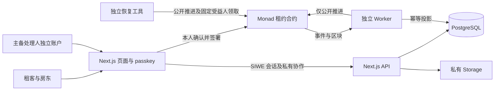
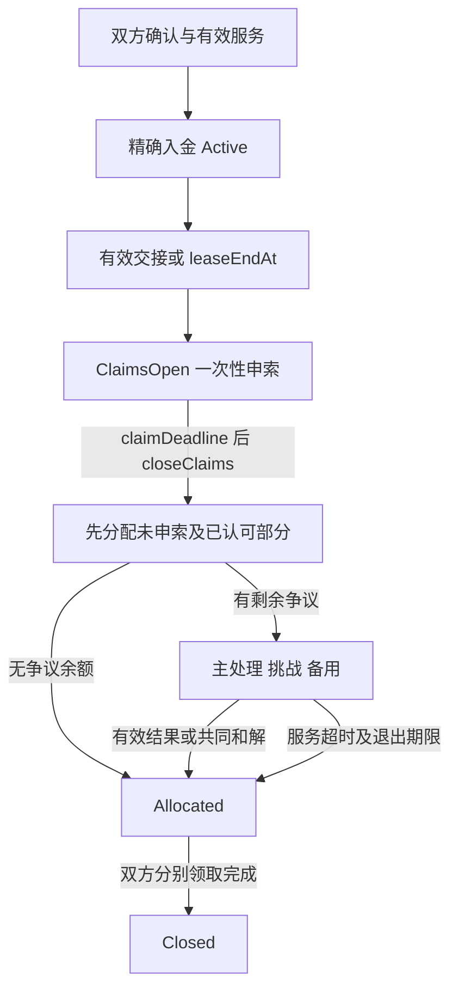

# 架构与资金信任边界

本图是目标架构，模块尚待实现；技术主栈沿用 v1.2，不因展示收窄换栈。

## 模块边界

| 模块 | 负责 | 不负责 |
| --- | --- | --- |
| 前端 C | 用户确认、签署、读取、展示、恢复账户 | 替用户同意、判断证据真伪 |
| API D | SIWE、ACL、草稿、材料版本、导出、受限测试补给 | 数据库直接设“已付款”、保管 T/L/R/F 私钥 |
| Worker E | 链事件投影、重放、持久任务和公开到期推进 | 作裁决、改变期限、代签用户 |
| 合约 B | 固定权限、金额分配、期限、领取 | 房屋真实性、法律资格和事实判断 |
| R/F | 按预先约定处理案件，给出理由 | 任意收款、访问全库、改既有资金权利 |

## 合约边界

`MockUSD`（受限测试铸币）、`ResolverRegistry`（不可变服务版本及授权）、`LeaseFactory`（暂停新建但不冻结旧租约）、`DepositEscrow`（每份租约独立、不可升级）。T/L/R/F 四地址互异。R/F 的服务快照在入金后不能被注册表撤销或后台改写。

## 关键状态与金额

完整转换表见 PRD 11.2。以下为主路径，交接案件、备用、和解及超时均必须另行实现：

`D = U + CT + CL + WT + WL`。合约 token 余额至少覆盖 `U+CT+CL`；额外误转不属于 D。API 金额字符串、TS bigint、数据库整数/numeric；业务步长 10,000 底层单位 = 0.01 MockUSD。

提交要求 `now < deadline`，推进要求 `now >= deadline`；延迟推进不重置起算点。`hardEndAt` 限定最终退出，先落实及时认可与成熟且未挑战的有效结果，再退剩余。`withdrawFor` 只向固定 T/L 付款；停运后不依赖后台许可。

## 数据与隐私

链上只放执行参数、地址、承诺值和资金事件。租约正文、照片、材料理由放数据库与私有 Storage，按租约/案件阶段授权；F 升级前不能读取案件。短链接 5 分钟，服务器 service key 不能替代业务 ACL。证据不可覆盖，提交与认可按精确版本记录。

事件按 chainId/txHash/logIndex 幂等，保存 blockHash 和同步检查点；回滚非规范区块投影。网络适配先实测 finality，再决定“已确认”，不能默认套其他链规则。详见 [接口](interfaces/README.md)。
